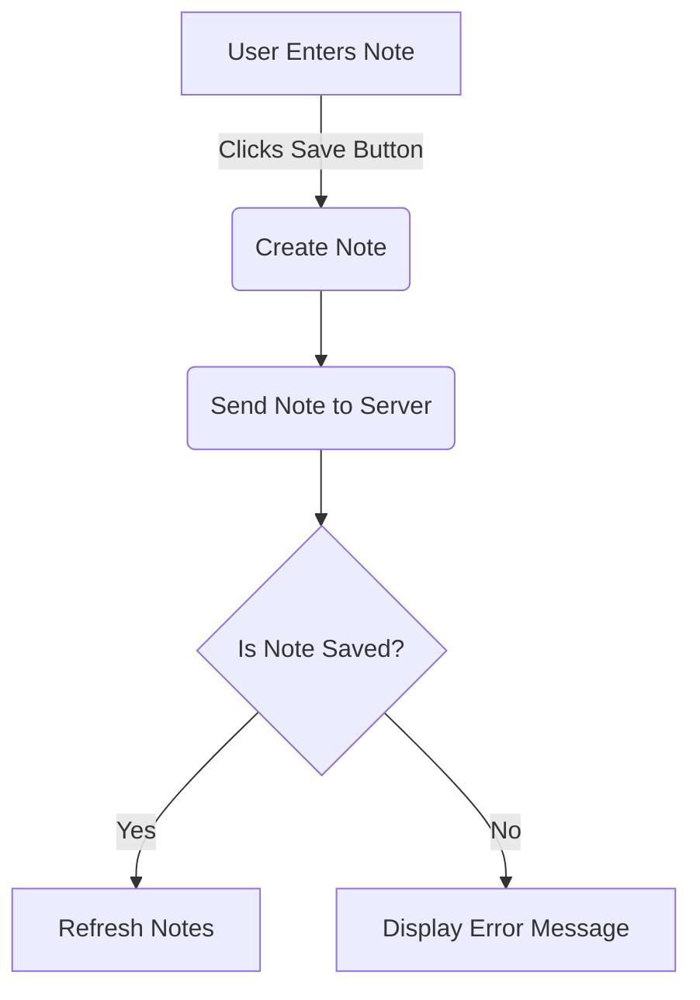

## Here is a simple flow chart where user goes to the single-page app version of the notes app

```mermaid
graph TD;
    A[User Enters Note] -->|Clicks Save Button| B(Create Note);
    B --> C(Send Note to Server);
    C --> D{Is Note Saved?};
    D -->|Yes| E[Refresh Notes];
    D -->|No| F[Display Error Message];
```