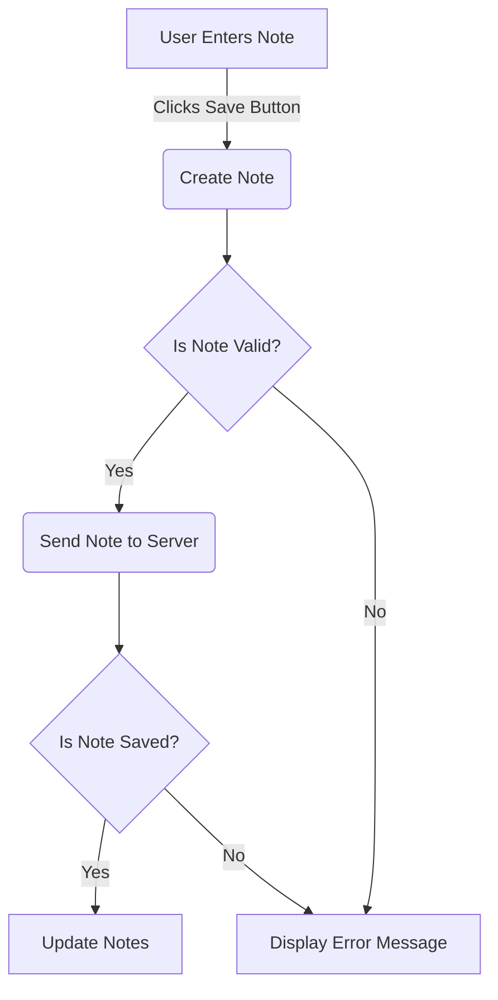

## Here is a simple flow chart where user creates a new note using the single-page version of the app

```mermaid
graph TD;
    A[User Enters Note] -->|Clicks Save Button| B(Create Note);
    B --> C{Is Note Valid?};
    C -->|Yes| D(Send Note to Server);
    D --> E{Is Note Saved?};
    E -->|Yes| F[Update Notes];
    E -->|No| G[Display Error Message];
    C -->|No| G;
```