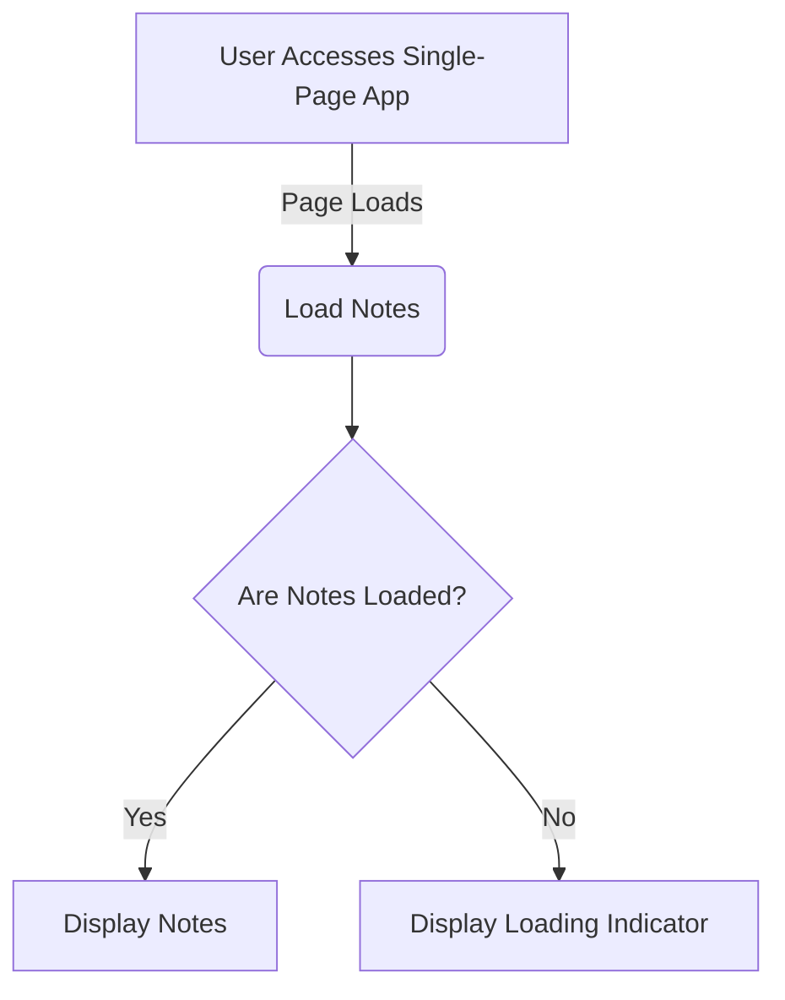

# Here is a diagram of a user access a single page

```mermaid
graph TD;
    A[User Accesses Single-Page App] -->|Page Loads| B(Load Notes);
    B --> C{Are Notes Loaded?};
    C -->|Yes| D[Display Notes];
    C -->|No| E[Display Loading Indicator];
```